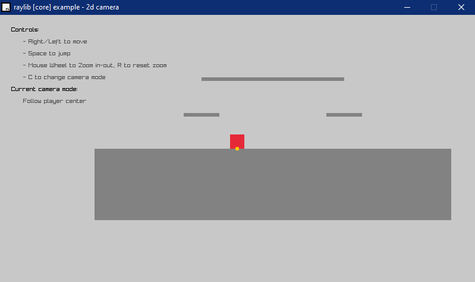
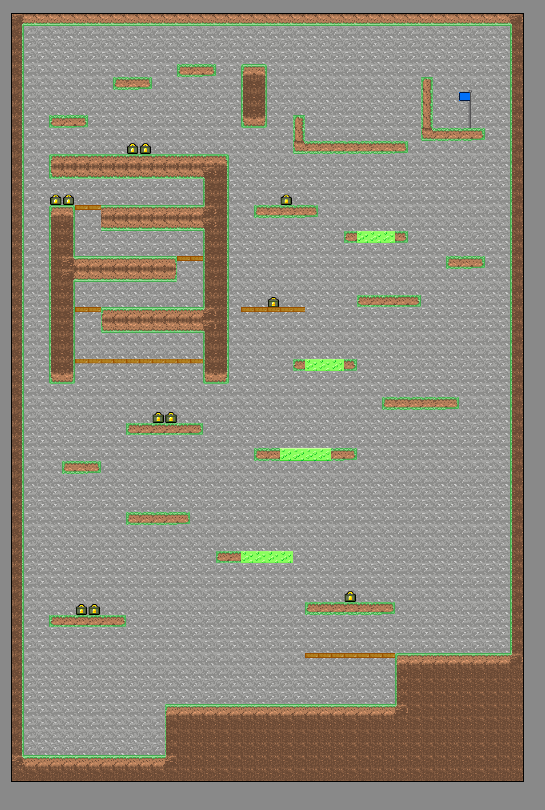
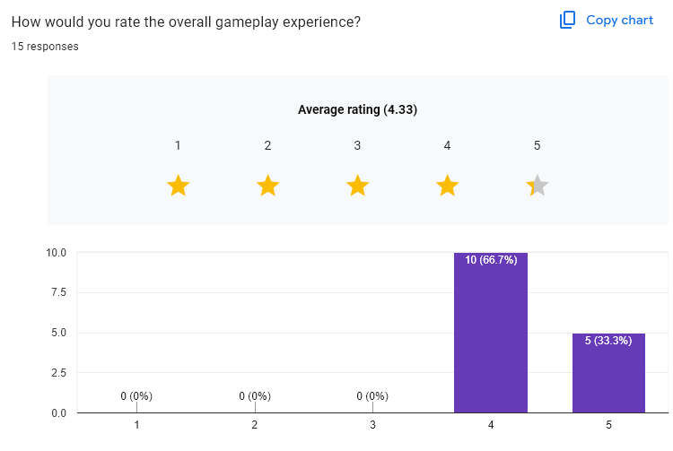
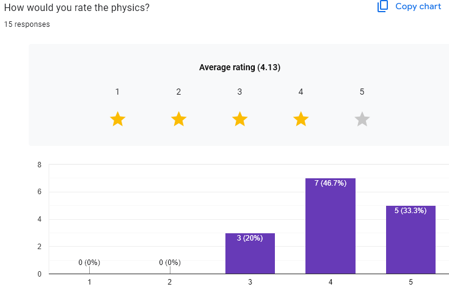
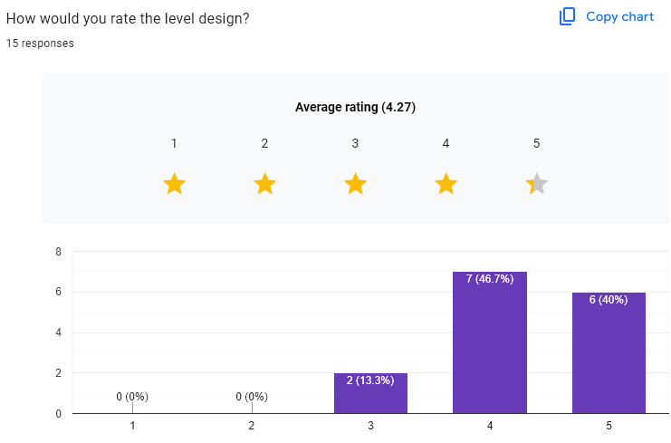

# Shotgun : Chargin' It | Development Commentary

Video Demonstration: https://youtu.be/-KILqwRjReQ

Itch.io Page: https://hunters-games.itch.io/shotgun-chargin-it

Repository Link: https://github.com/Huntertheheavy/FGCT4015-RayLib-Shotgun-Chargin-It

Programming Documentation: Within source code via `//programming comments`

## Abstract

***Shotgun : Chargin' It*** is a point-and-click 2D side-and-top-scrolling rage platformer developed in RayLib. The core concept of the game is a player character that can only move by clicking on the screen, and pushing the player character away from the cursor. The goal of the game is to reach the goal post, thus ending the level, and the level is designed to be more vertically oriented than horizontal, punishing falling off platforms. This is diegetically justified by the game's theming of hiking, and the player character being a hiker with no legs, who must propel himself towards the top by aiming downwards with a shotgun and charging it up. The game is a spiritual spin-off to a sister project, [Shotgun : Deal With It](https://gamejolt.com/games/shotgundealwithitVS/880606), which has the same premise, but it has enemies and no charging system. Regarding the technical and creation side of the project, the goals for the project were at least; a singular level, multiple terrain types to create variety in level design, a win and lose screen, a player controller that involves: following the cursor with their gun, a charge system that triggers when holding down the click, pushing the player away from the cursor once its released, an ammo system with boxes to be collected, and methods to restart the game and put the game in fullscreen, a timer system that saves the lowest score, and art assets to give the game a cohesive style and justification for it's gameplay. These goals were derived from the project's requirements, which were; the use of an 'if/else' or 'switch' statement, a tracked variable, a sprite, an animation or a sprite, music, a sound effect when the sprite changes, an array, iterating through an array, saving and loading data, a particle system, and an animation.

## Research

### Learning C++ and Raylib

With no knowledge and experience in either, the first task at hand was the most necessary to research, as no game can be made with no program to facilitate it. 

#### Sources

- ***Mike McGraph's C, C++ & C# in easy steps*** was key to understanding the base language and it's syntax, and helped immensely with learning the basic knowledge of C++ to begin working on the project. Syntax and features of the language were key, as it allows a steady workflow with minimal time wasted on bug fixing and research while programming on what can be done.

    What key takeaways were taken from Mike Mcgraph's book to a programmer with no C++ knowledge and are relevant to the project?

    - General syntax
    - Switch statements are available, as some programming languages do not have switch statements
    - Memory management is key in C based languages

- ***The Raylib CheatSheet*** was not researched prior to the creation of the game, but rather was used throughout the entire creation process. It was key to understanding what could easily be done in Raylib without external libraries or mass amounts of code needed to be written to do something. The game would have essentially be impossible to make without the cheatsheet, as all knowledge on RayLib can be derived from it.
    
    What key takeaways were taken from the RayLib cheatsheet that are relevant to the project?
    
    - How to load textures and sound
    - How to draw things into the window to make them visible
    - How to play audio
    - How to manipulate the window size
    - How to apply controls regarding the mouse and keyboard
    - How to set the target frames-per-second
    - How to handle memory with RayLib's own system
    
- ***The RayMath CheatSheet*** was also not researched prior to the creation of the game. Although, it was key to certain aspects of the game, namely: clamping values and the trigonometry required to have something rotate in the direction of the cursor using vector math.

    What key take ways were taken from the RayMath cheatsheet that are relevant to the project?
    - Vector Math
    - Clamping values 
    
### Game Inspiration

To make a game, one must research what is viable as a game to get a better understanding on what can be made for the project, as it may have already been done before. Research may also bring original ideas, as ideas presented in pre-existing projects can be taken and be subverted or have additional elements added on to be original.

#### Sources

A platforming rage game with a hiking theming did not come from nowhere. 'Shotgun : Chargin' It' and its sister-project 'Shotgun : Deal With It' are directly inspired and homage to ***Getting Over It with Bennet Foddy***, shortened to *Getting Over It*. *Getting Over It* is a point-and-click platformer, self described as a 'psychological-horror' on its Steam page, where you play as a man in a cast-iron cauldron, who must drag himself up a mountainous structure to get to the end of the game. It's difficult and unfair level design, and its nature of being a platformer that is controlled like a point and click game, are what are most relevant to this project. 

To justify making a game like *Getting Over It*, it must be said that the game has recieved critical acclaim, with 2.8 million units sold, 82.4% positive reviews (Getting Over It with Bennett Foddy – Steam Stats, s.d.), and the sample size of said reviews, which is 65,304/79,262 being positive reviews (Getting Over It with Bennett Foddy on Steam, s.d.), is enough to indicate that generally speaking, this game's positive reviews are not simply luck, but rather an indication that there is a market for games such as there.
    
What key takeaways were taken from *Getting Over It* that are relevant to the project?

- A game like 'Shotgun : Chargin' It' is possible as 'Getting Over It' has a similar, yet even more complex, system that translates mouse controls to the movement of a player character on a 2D field
- The key to making a game of this calibre is its difficulty and level design, as fun and replayability can be derived from the challenge
- A game such as this has potential to be successful, as evident by its sales and reception

### Libraries 

To tilemap, the game an external library was used, as it would save a lot of time developing an entire tilemapping system, especially since there are tools like ***Tiled*** which turn tilemapping to a process more like pixel-art-esque.

The library used for the project is ***Raytilemap*** by JeffM2501 on GitHub.

## Implementation

The implementation of the game was structured in three concise phases on development.

- Core Feature Implementation
- Visuals and UI 
- Tweaking and Bug Fixing

### Core Feature Implementation

This phase was concerned most implementing features of the game without concern of the visuals. This began with taking a RayLib game sample from Raylib's files. The sample used as a template was `core_2d_camera_platformer.c `, as it has a player controller, terrain, and an adjustable camera already implemented, with a zoom system on top. For the game being made, a camera zoom system is not necessary, but it is not an unwelcome addition to the project, so it was kept.



[ Figure 1. `core_2d_camera_platformer.c.png` when compiled.]

#### The Player

At this point, the systems necessary were made to facilitate the specific player controller needed for the project. This was, and the camera function too, in a separate file from `main.cpp`, that being `player.cpp` along with `player.hpp` to allow `main.cpp` to get access to the variables.

```
static void UpdatePlayerStep(Player *player, EnvItem *envItems, int envItemsLength, float delta, Camera2D camera)
{
    //apply gravity
    player->speed.y += G * delta;

    //reload timer
    if (player->reloadTimer > 0.0f)
    {
        player->reloadTimer -= delta;
        if (player->reloadTimer < 0.0f) player->reloadTimer = 0.0f;
    }

    //charge shot
    if (IsMouseButtonDown(MOUSE_BUTTON_LEFT))
    {
        player->heldTimer += (delta * 1.5f);
        if (player->heldTimer > 1.0f) player->heldTimer = 1.0f;
        player->heldTimerMult = player->heldTimer / 1.0f;
    }

    //release shot
    if (IsMouseButtonReleased(MOUSE_BUTTON_LEFT))
    {
        int ammoToUse = 1;
        if (player->heldTimerMult <= 0.33f)
            ammoToUse = 1;
        else if (player->heldTimerMult < 1.0f)
            ammoToUse = 2;
        else
            ammoToUse = 3;

        if (ammoToUse > player->Ammo) ammoToUse = player->Ammo;

        if (ammoToUse > 0 && player->reloadTimer <= 0.0f)
        {
            player->Ammo -= ammoToUse;

            Vector2 mouseWorld = GetScreenToWorld2D(GetMousePosition(), camera);
            Vector2 direction = Vector2Subtract(player->position, mouseWorld);

            if (Vector2Length(direction) > 0.1f)
            {
                direction = Vector2Normalize(direction);
                player->speed.x += direction.x * MOUSE_FORCE * delta * player->heldTimerMult;
                player->speed.y += direction.y * MOUSE_FORCE * delta * player->heldTimerMult;
                player->reloadTimer = 0.1f;
                player->heldTimer = 0.0f;
                player->heldTimerMult = 0.0f;
            }
        }
    }
    
     Vector2 nextPos = Vector2Add(player->position, Vector2Scale(player->speed, delta));
    player->onGround = false;
    Rectangle playerRect = { nextPos.x - 20, nextPos.y - 40, 40, 40 };
        
        
    void UpdatePlayer(Player *player, EnvItem *envItems, int envItemsLength, float delta, Camera2D camera)
{   
    //clamp deltatime to prevent clipping
    if (delta > MAX_DELTA)
        delta = MAX_DELTA;

    float remaining = delta;
    while (remaining > 0.0f)
    {
        float dt = fminf(remaining, PHYSICS_STEP);
        UpdatePlayerStep(player, envItems, envItemsLength, dt, camera);
        remaining -= dt;
    }
}
    
```
[ Figure 2. UpdatePlayerStep and UpdatePlayer.]

(Note: The code is not identical to at this moment in the development process. However, most of it was written in this point in time. This goes for all code before the bug fixing phase.)

The function `UpdatePlayerStep`  essentially gets the position of the mouse when clicked, times how long it is held down, then when the mouse is released, apply a force based on how long the mouse has been held and where the mouse is in relation to the player.  It also applies gravity and a reload timer to the player.

#### Terrain Types

Since it was most convenient, the code relating to terrain types was placed in `player.cpp` as well, since it involves collisions with the player and the code for it its pretty minuscule to warrant another file.

```
    for (int i = 0; i < envItemsLength; i++)
    {
        EnvItem *ei = envItems + i;
        Rectangle rect = ei->rect;
        
        

        if (ei->solidAllSides)
        {
            if (CheckCollisionRecs(playerRect, rect))
            {
                float overlapLeft   = (playerRect.x + playerRect.width) - rect.x;
                float overlapRight  = (rect.x + rect.width) - playerRect.x;
                float overlapTop    = (playerRect.y + playerRect.height) - rect.y;
                float overlapBottom = (rect.y + rect.height) - playerRect.y;

                float minOverlapX = fminf(overlapLeft, overlapRight);
                float minOverlapY = fminf(overlapTop, overlapBottom);

                if (minOverlapX < minOverlapY)
                {
                    if (overlapLeft < overlapRight)
                        nextPos.x = rect.x - playerRect.width / 2;
                    else
                        nextPos.x = rect.x + rect.width + playerRect.width / 2;
                    player->speed.x = 0;
                }
                else
                {
                    if (overlapTop < overlapBottom)
                    {   
                        //bouncy block logic
                        nextPos.y = rect.y;
                        if (ei->bouncy)
                            player->speed.y = -fabsf(player->speed.y) * BOUNCE_DAMPING;
                        else
                        {
                            player->speed.y = 0;
                            player->onGround = true;
                        }
                    }
                    else
                    {
                        nextPos.y = rect.y + rect.height + 40;
                        if (ei->bouncy)
                            player->speed.y = fabsf(player->speed.y) * BOUNCE_DAMPING;
                        else
                            player->speed.y = 0;
                    }
                }
            }
        }
        
        //collisions for semi solid blocks
        else if (ei->blocking)
        {
            if (playerRect.x + playerRect.width > rect.x &&
                playerRect.x < rect.x + rect.width &&
                player->position.y <= rect.y &&
                nextPos.y >= rect.y)
            {
                //bouncy block logic
                player->onGround = true;
                player->speed.y = ei->bouncy ? -fabsf(player->speed.y) * BOUNCE_DAMPING : 0;
                nextPos.y = rect.y;
            }
        }
    }

    //apply friction to player
    if (player->onGround)
        player->speed.x *= FRICTION;

    player->position = nextPos;
}
```
[ Figure 3. Terrain type and collision code.]


What this code does is initialize each terrain type, checks for collisions, and creates the necessary information relating to them when collided with. The specific terrain types created are the following:

- `blocking` : Semi-solid blocks that allow the player to pass from all-sides except blocking the top 
- `solidAllSides` : Solid terrain from all sides
- `bouncy` : Makes the player bounce when hitting it vertically

#### Ammo System

Although it involves collisions with the player, logic regarding ammo boxes was moved to a separate file; `ammobox.cpp` and `ammobox.hpp`. This is because ammo boxes are destroyed when collided with, also they are thematically different to the terrain types and also is keeps the code more organized to keep some code outside of just `main.cpp` and `player.cpp`.

```
//initializing ammoboxes
ammoBox* CreateAmmoBox(float x, float y, int ammoAmount) {
    ammoBox *box = (ammoBox *)malloc(sizeof(ammoBox));
    if (box) {
        box->position = { x, y };
        box->size = { 40, 40 };
        box->ammoAmount = ammoAmount;
        box->isCollected = false;
    }
    return box;
}


//update ammoboxes
void UpdateAmmoBoxes(ammoBox **boxes, int boxCount, Player *player) {
    for (int i = 0; i < boxCount; i++) {
        ammoBox *box = boxes[i];
        if (!box->isCollected) {
            Rectangle playerRect = { player->position.x - 20, player->position.y - 40, 40, 40 };
            Rectangle boxRect = { box->position.x, box->position.y, box->size.x, box->size.y };

            if (CheckCollisionRecs(playerRect, boxRect)) {
                player->Ammo += box->ammoAmount;
                box->isCollected = true;
            }
        }
    }
}
```
[ Figure 4. CreateAmmoBox and UpdateAmmoBoxes.]


What this code does is initializes ammoboxes, and updates them when collided with the player. When ammo boxes are initialized in `main.cpp`, its `ammoAmount` is assigned as 30, which equates to 10 max charged shots since in `player.cpp`, max shots subtract 3 ammo.

#### Lose Condition

The rest of the code is found in `main.cpp` . This is where non-player character related controls, drawing, initializing and de-initializing, and file saving and loading. Some of which was still developed in this phase. Excluding simple initialization, the last relevant code to this phase is the lose condition, developed along side the ammo system as they are directly related.

```

  if (player.Ammo <= 0 && player.onGround && fabs(player.speed.x) < 0.1f && fabs(player.speed.y) < 0.1f)
        {
            isGameOver = true;
            controlsVisible = false;
        }
        
        
  ...
  
   if (isGameOver)
        {
            const char* gameOverText = "STRANDED";
            int fontSize = 100;
            int textWidth = MeasureText(gameOverText, fontSize);
            int textX = (screenWidth - textWidth) / 2;
            int textY = screenHeight / 2 - fontSize;
            DrawText(gameOverText, textX, textY, fontSize, RED);

            const char* continueText = "Press 'R' To Continue";
            int continueFontSize = 30;
            int continueTextWidth = MeasureText(continueText, continueFontSize);
            int continueX = (screenWidth - continueTextWidth) / 2;
            int continueY = textY + fontSize + 20;
            DrawText(continueText, continueX, continueY, continueFontSize, BLACK);
        }
```
[ Figure 5. Game over code.]
#### Win Condition

To actually finish the level, there must be a system that checks if you reached the end of the level. This was developed soon after the tilemapping was done. The goal itself is placed in the tilemap.

```
 //goal check
        if (goalFound && CheckCollisionRecs(playerRect, goalBlock.rect))
        {
            isGameWon = true;

            if (prevPlayTime < 0.0f || playTime < prevPlayTime)
            {
                FILE* out = fopen("include/playtime.txt", "w");
                if (out) { fprintf(out, "Lowest Play Time: %.2f seconds\n", playTime); fclose(out); }
                prevPlayTime = playTime; // update immediately to show
            }
        }
```


[ Figure 6. Win condition code.]

### Visuals and Level Design

At this point, the core features of the game were complete. All that was left was drawing and creating terrain based on a tilemap file, drawing more stats to the screen, adding particles and playing audio.

#### Audio

Audio was the first feature implemented at this stage. This is because audio is fairly easy and straight forward to implement compared to the rest, so it was an easy task to check off the list of what was needed to be implemented. The audio used was general background audio to act as ambience, plus it also adds a layer of polish to the game, and a sound effect that plays when the gun is shot.

```
    Sound shotgunBlast = LoadSound("resources/explosion.wav");
    Music ambience = LoadMusicStream("resources/environment.mp3");
    
    ...
    
    //music playing
    PlayMusicStream(ambience);
    
    ...
            //shooting controls not related to player physics
        if (IsMouseButtonReleased(MOUSE_BUTTON_LEFT) && !isGameOver && !isGameWon)
        {
            float randomPitch = GetRandomValue(800, 1200);
            SetSoundPitch(shotgunBlast, randomPitch / 1000);
            SetSoundVolume(shotgunBlast, 0.9f);
            PlaySound(shotgunBlast);
            animFrame = 0;
            animTimer = 0.2f;
        }
        
```
[ Figure 7. Audio code.]

#### Art

The art was mostly ripped straight from the sister project; *Shotgun : Deal With It*, but at the time of making them, it was a process that involved a heavy amount of drawing and iterating. The only exception was the slime block texture, which is for the `bouncy` terrain, and a smoke texture. Those were made specifically for this game


[ Figure 8. The tileset and the main player sprite as an example of the sprites in the project.]

#### Tilemapping

From previous experience, *Tiled* was used as the program to generate a tilemap. It works as a GUI that turns tilemapping to a pixel-art-esque grid, where placing level elements is easy. This came at the cost of trying to implement the .tmx files generated by *Tiled*.

It was then decided to opt for an external code library outside the official RayLib libraries to be used to convert the .tmx file to drawn textures and loaded terrain, which was when Raytilemap was used. 

However, the library did not have proper documentation or tutorials on how to use it, and since going through the code itself and trying to understand what it means and how it use it was especially time consuming, ChatGPT was used to simply read the code, and implement its function in `main.cpp`. That was genuinely the best solution, as the alternative would be a waste of time for the exact same results.

There was a bug in the tilemapping where the texture selected from the texture atlas would be the one next to it. That is why in the previous figure, the tileset has each texture doubled. However, later on, the bug fixed itself. The tilset was kept how it was as to timesave, plus it does not take too much file space.

```
//rayTiled stuff, genuinely got no idea what's going on here. Library had no tutorial how to use it so code was generated with ChatGPT 5
    for (size_t i = 0; i < tileMap.Layers.size(); i++)
    {
        RayTiled::LayerInfo* layer = tileMap.Layers[i].get();
        const char* lname = layer->Name.c_str();
        if (strcmp(lname, "background") == 0) continue;

        int blocking = 0, solidAllSides = 0, bouncy = 0;
        bool makeEnv = false, makeAmmo = false, makeGoal = false;

        if (strcmp(lname, "solidblock") == 0) { blocking = 1; solidAllSides = 1; makeEnv = true; }
        else if (strcmp(lname, "semisolidblock") == 0) { blocking = 1; makeEnv = true; }
        else if (strcmp(lname, "bouncyblock") == 0) { blocking = 1; solidAllSides = 1; bouncy = 1; makeEnv = true; }
        else if (strcmp(lname, "ammo") == 0) makeAmmo = true;
        else if (strcmp(lname, "goal") == 0) makeGoal = true;

        if (layer->Type == RayTiled::TileLayerType::Tile)
        {
            RayTiled::TileLayer* tileLayer = static_cast<RayTiled::TileLayer*>(layer);
            int width = (int)tileLayer->Bounds.x;
            int height = (int)tileLayer->Bounds.y;

            for (int y = 0; y < height; y++)
            {
                for (int x = 0; x < width; x++)
                {
                    int idx = y * width + x;
                    if (idx >= (int)tileLayer->TileData.size()) continue;
                    unsigned int tileId = tileLayer->TileData[idx].TileIndex;
                    if (tileId == 0) continue;

                    float worldX = x * tileLayer->TileSize.x;
                    float worldY = y * tileLayer->TileSize.y;
                    Rectangle rect = {worldX, worldY, tileLayer->TileSize.x, tileLayer->TileSize.y};

                    if (makeEnv)
                        envItemsVec.push_back({rect, blocking, solidAllSides, bouncy, {0,0,0,0}});
                    else if (makeAmmo)
                        ammoBoxesVec.push_back(CreateAmmoBox(worldX, worldY, 30)); //ammoAmount is 30
                    else if (makeGoal && !goalFound)
                    {
                        goalBlock = {rect, 1, 1, 0, MAROON};
                        goalFound = true;
                    }
                }
            }
        }
    }

    //load terrain
    int envItemsLength = envItemsVec.size();
    EnvItem* envItems = (EnvItem*)malloc(sizeof(EnvItem) * envItemsLength);
    memcpy(envItems, envItemsVec.data(), sizeof(EnvItem) * envItemsLength);

    //load ammo boxes
    int ammoBoxCount = ammoBoxesVec.size();
    ammoBox** ammoBoxes = (ammoBox**)malloc(sizeof(ammoBox*) * ammoBoxCount);
    memcpy(ammoBoxes, ammoBoxesVec.data(), sizeof(ammoBox*) * ammoBoxCount);
```

[ Figure 9. Tilemapping logic.]

Once the actual tile mapping code was implemented, the level was then designed. The goal for the level was to have a very tall level, like *Getting Over It with Bennett Foddy*, with jumps intentionally designed to make you lose a lot of progress if failed, and to utilize each terrain type outside of just the beginning of the level. On the topic of the beginning of the level, the level design should get progressively harder. From a soft-tutorial that doesn't punish the player, so jumps that when missed punish the player even heavily. There is a 'troll' section midway through the level to intentionally trick the player. This is because it is to fit the theming of a 'rage game' like *Getting Over It*. However, at the end of the 'troll' section, there are ammo boxes as to forgive the player from wasting their time.



[ Figure 10. Level created In Tiled.]

#### Timer and Lowest Time

Once the level was designed using *Tiled*, the need for saved data became even more apparent, as it was a requirement of the project. Due to the nature of the game, a 'high score' or a 'save and load progress' feature was not exactly fitting. However, a 'best time' system made sense. The game is a challenging platformer that is short. It facilitates speedrunning easier, and it adds replayability. So a system was designed to create a text file with the lowest time when the player reaches the end of the level, and upon reinitializing the game, it reads that file.

```
//check for save data for high score
    FILE* in = fopen("include/playtime.txt", "r");
    if (in)
    {
        char buf[128];
        if (fgets(buf, sizeof(buf), in))
        {
            float val = 0.0f;
            if (sscanf(buf, "Lowest Play Time: %f", &val) == 1) prevPlayTime = val;
            else if (sscanf(buf, "%*[^0-9]%f", &val) == 1) prevPlayTime = val;
        }
        fclose(in);
    }

...

 if (prevPlayTime >= 0.0f)
            {
                const char* lowestText = TextFormat("Lowest Time: %.2f s", prevPlayTime);
                int lowestFontSize = 30;
                int lowestWidth = MeasureText(lowestText, lowestFontSize);
                int lowestX = (screenWidth - lowestWidth) / 2;
                int lowestY = textY + fontSize + 10;
                DrawText(lowestText, lowestX, lowestY, lowestFontSize, BLUE);
            }

```

[ Figure 11. Save and load lowest time.]

#### Fullscreen Functionality

Since the game is pixelart based, the resolution for the game is considerably small, so to fix this issue, the game checks for the screen's resolution, and then stretches the game to fit the screen.

```
//fullscreen toggle controls
        if (IsKeyPressed(KEY_F))
        {
            isFullScreen = !isFullScreen;
            if (isFullScreen)
            {
                int monitor = GetCurrentMonitor();
                SetWindowSize(GetMonitorWidth(monitor), GetMonitorHeight(monitor));
                ToggleFullscreen();
                DisableCursor();
            }
            else
            {
                ToggleFullscreen();
                SetWindowSize(screenWidth, screenHeight);
                EnableCursor();
            }
        }
```

[ Figure 12. Toggleable fullscreen with 'F'.]

#### Toggleable Controls and Exposition 

For the game, a title screen is not really necessary, as it is a singular level, you can quit the game with the escape key, and there are no options. So instead of menus, it was decided that the game will have a welcome message that explains the general premise of the game along side its controls.

```

        //contros menus toggle controls
        if (IsKeyPressed(KEY_C))
        {
            controlsVisible = !controlsVisible;
        }
        
        ...
        
        //drawing controls menu
        if (controlsVisible)
        {
            int fontSize = 20;
            int lineSpacing = 22;
            int startY = 20;

            DrawText("Welcome to Shotgun : Chargin' It",(screenWidth - MeasureText("Welcome to Shotgun : Chargin' It", fontSize)) / 2, startY, fontSize, BLACK);
            DrawText("The aim of the game is to reach the flag pole at the top of the map.", (screenWidth - MeasureText("The aim of the game is to reach the flag pole at the top of the map.", fontSize)) / 2, startY + lineSpacing, fontSize, BLACK);
            DrawText("Controls:", (screenWidth - MeasureText("Controls:", fontSize)) / 2, startY + lineSpacing * 3, fontSize, RED);
            DrawText("Left Mouse Click - Shoot", (screenWidth - MeasureText("Left Mouse Click - Shoot", fontSize)) / 2, startY + lineSpacing * 4, fontSize, BLACK);
            DrawText("Scroll Wheel - Camera Zoom", (screenWidth - MeasureText("Scroll Wheel - Camera Zoom", fontSize)) / 2, startY + lineSpacing * 5, fontSize, BLACK);
            DrawText("R - Restart", (screenWidth - MeasureText("R - Restart", fontSize)) / 2, startY + lineSpacing * 6, fontSize, BLACK);
            DrawText("F - Toggle Fullscreen", (screenWidth - MeasureText("F - Toggle Fullscreen", fontSize)) / 2, startY + lineSpacing * 7, fontSize, BLACK);
            DrawText("C - Toggle this menu", (screenWidth - MeasureText("C - Toggle this menu", fontSize)) / 2, startY + lineSpacing * 8, fontSize, BLACK);
        }
```
[ Figure 13. Toggleable controls menu with 'C'.]

#### Camera Clamping

An issue raised since the implementation of the tilemap, was the camera extending beyond the loaded map. So to counteract this, the camera has zooming clamps and does not push past the walls.

``` 

MAIN.CPP
//camera zooming controls
        camera.zoom += GetMouseWheelMove() * 0.05f;
        camera.zoom = Clamp(camera.zoom, 0.75f, 3.0f);

PLAYER.CPP

void UpdateCameraCenterInsideMap(Camera2D *camera, Player *player, EnvItem *envItems, int envItemsLength, float delta, int width, int height)
{
    camera->target = player->position;
    camera->offset = (Vector2){ width / 2.0f, height / 2.0f };

    float minX = 1000, minY = 1000, maxX = -1000, maxY = -1000;

    for (int i = 0; i < envItemsLength; i++)
    {
        EnvItem *ei = envItems + i;
        minX = fminf(ei->rect.x, minX);
        maxX = fmaxf(ei->rect.x + ei->rect.width, maxX);
        minY = fminf(ei->rect.y, minY);
        maxY = fmaxf(ei->rect.y + ei->rect.height, maxY);
    }

    Vector2 max = GetWorldToScreen2D((Vector2){ maxX, maxY }, *camera);
    Vector2 min = GetWorldToScreen2D((Vector2){ minX, minY }, *camera);

    if (max.x < width) camera->offset.x = width - (max.x - width / 2);
    if (max.y < height) camera->offset.y = height - (max.y - height / 2);
    if (min.x > 0) camera->offset.x = width / 2 - min.x;
    if (min.y > 0) camera->offset.y = height / 2 - min.y;
}   
        
```
[ Figure 14. Camera clamping logic.]

### Tweaking and Bug Fixing

This point of the project was happening simultaneously with playtesting phase, as feedback from play testers or viewing their gameplay lead to realizations on how to improve the game, and ideas on additional features to be added.

#### Level Design

The Level has remained mostly unchanged throughout visuals and tweaking, as most play testers did not have glaring issues with the level design. Some platforms were made larger, the long platform in the middle with slime blocks had some of the slime blocks removed to make the horizontal jump to it somewhat easier to manage.

#### Falling Speed and Clipping

There was a bug where when the window was paused, such as when the fullscreen was toggled, or when the window is being dragged, the player falls through the ground. This was fixed with clamping deltatime and by having a physicsstep to update the player.

The player falling speed was also considered too fast. So it was slowed down as the physicsstep was halved and the shooting force was adjusted to keep the level design compared to the player identical while also making the feeling of falling down be more elegant.

```
//physics constants
#define MAX_DELTA        0.05f     // Clamp delta to avoid tunneling on freeze (≈ 20 FPS)
#define PHYSICS_STEP     0.016f    // Substep size (≈ 60 FPS)

...

void UpdatePlayer(Player *player, EnvItem *envItems, int envItemsLength, float delta, Camera2D camera)
{   
    //clamp deltatime to prevent clipping
    if (delta > MAX_DELTA)
        delta = MAX_DELTA;

    float remaining = delta;
    while (remaining > 0.0f)
    {
        float dt = fminf(remaining, PHYSICS_STEP);
        UpdatePlayerStep(player, envItems, envItemsLength, dt, camera);
        remaining -= dt;
    }
}
```
[ Figure 15. Physics Step and clamping deltatime.]

#### Sound Pitch Variation

Some play testers commented that the gun sound effect was annoying as it was the same over and over, and some suggested pitch or volume randomness, or having it scale based on the shotgun charge. What was implemented was simple pitch variation, because the volume function was just not working as intended, so it was scrapped in favor of just pitch variance.

```
            //shooting controls not related to player physics
        if (IsMouseButtonReleased(MOUSE_BUTTON_LEFT) && !isGameOver && !isGameWon)
        {
            float randomPitch = GetRandomValue(800, 1200);
            SetSoundPitch(shotgunBlast, randomPitch / 1000);
            SetSoundVolume(shotgunBlast, 0.9f);
            PlaySound(shotgunBlast);
            animFrame = 0;
            animTimer = 0.2f;
        }
```
[ Figure 16. Sound pitch randomness in the shooting controls.]

#### Particle System

To ensure a better polished game, it was decided as the last feature to add was a particle system that would create smoke particles if the player character exceeds a certain speed. What is does is creates a particle with a timer on the player's position if their speed magnitude exceeds 200.

```
    //initialize particles
    player->particleTimer += delta;
    float speedMag = Vector2Length(player->speed);
    if (player->particleTimer >= 0.05f && speedMag > 200.0f) 
    {
        Particle p;
        p.position = player->position;
        p.speed = {0, 500.0f}; 
        p.life = 0.24f;        
        player->particles.push_back(p);
        player->particleTimer = 0.0f;
    }

    //update existing particles
    for (size_t i = 0; i < player->particles.size();)
    {
        Particle &p = player->particles[i];
        p.position.y += p.speed.y * delta; // fall
        p.life -= delta;
        if (p.life <= 0)
            player->particles.erase(player->particles.begin() + i);
        else
            i++;
    }
```
[ Figure 17. Smoke Particle Logic.]

## Testing 

### Methodology 

The methodology used for playtesting was blind playtests. Personal notes were taken for the playtests that were overseen. Once the play tester was finished with the playtest, they were tasked to fill out a survey rating the gameplay, physics and level design, and additionally, they were given an option to write out their opinions justifying the rating. This is to ensure data is processed without forcing testers to write out alot, because some may be demotivated to finish the survey if forced to write.

The goal's wanted to be achieved by testing is to point out flaws in game design, to find technical bugs, and to think of new ideas for the project.

The first play tester play tested the game right after tilemapping, but then was used as the last play tester. This was to ensure there was improvement between the first tested build, and the final candidate build.

### Statistics

The following are the statistics generated from the survey results:


[ Figure 18. Gameplay Ratings.] 


[ Figure 19. Physics Ratings.]


[ Figure 20. Level Design Ratings.]

What can be derived from the statistics is that although the game is generally liked in terms of all aspects, but they all do need some attention to tweak and perfect, as all of them have the average result be at 4/5 as opposed to 5/5, and 2/3 of the sections have respondents picking 3/5. This is indicative of a generally positive reception for the game. This means applying some of the feedback would not be too much of an issue or concern as the game is already generally liked. That does not mean ignoring issues, it simply means weighing time as an opportunity cost to each fix.

### Observations and Conclusions

Based on personal observations and what play testers commonly said while being observed or wrote in the freeform sections of the survey, the following notes were taken based on commonly repeated feedback.

- The 'troll' section of the level is the path most players take
- Physics are inconsistent -> clipping
- Challenging, yet fun
- Controls take some time to get used to
- 'Evil' level design
- Bouncy platforms are hard to understand
- The early game is well designed to accommodate as a tutorial
- Player gravity is way too strong
- Game too slippery
- Shoot/Jump physics feel inconsistent
- Shotgun Sound is annoying

#### Addressing The Negative Conclusions

Some solutions to some observations were foregone either due to the feedback commenting on something intentional or validating a decision, or its solution being too costly in terms of time.

##### Physics are inconsistent + Shoot/Jump physics feel inconsistent + Player gravity is way too strong

The solution was to clamp the deltatime to prevent this as much as possible, with it only occurring under rare, hard to replicate occurrences. This in turn changed the physics, so the player jump was adjusted, but the shooting force was increased in proportion to the physics, to be quite more forgiving to players by giving them a wider range of places they can land on. A symptom of the physics clamping was that the fall speed was made slower.

This also acts as a soft fix to the controls being difficult to get used to, as the previous fixes make the game easier to controlled.

##### Shotgun Sound being annoying

Two testers pointed out this issue early on in the testing phase. Both provided a solution, which included scaling the audio to the shotgun charge, and having the pitch change randomly. Both were tried to be implemented, but only the pitch variance was actually achieved.

## Reflection

### Positive Analysis

#### Research

A heavy amount of research on C, C++ and RayLib was done before and during the making of the game to ensure an at least cursory understanding of the language that could be further improved during the making of the game with the consulting of AI models and peers.

#### Achievement of Goals

All requirements and goals set for the project were done, and the result is a challenging and quite fun platformer. 

#### Art Direction

The game's visuals are one of it's strongest attributes. With all of the assets created manually for the project, its visual are cohesive and fitting. Ontop of that, all of the terrain types (including ammo) have distinctive visuals to ensure lack of confusion when viewing them. It's clear by the shape of the ammo box, that its a collectable rather than a terrain type, and its clear that the semi-solid platforms and the bouncy slime blocks behave differently to the grassy solid blocks

#### Level Design

The game's level design makes use of all of the terrain types quite effectively. For the troll maze section and to be charitable to the player by giving them an easy ammobox, semi-solids were used. Bouncy slime blocks were used to add challenge to jumps, making the player think more before doing a jump. 

The use of all terrain types is especially a positive as it means the code made to create said terrain types was not wasted on something novel, but rather integral to the game.

### Negative Analysis

#### Research

Research regarding why a game like *Getting Over It* should be made was not really considered until the end of the project. The game itself was inspiration, but outside of a cursory understanding of it's popularity and game design, not much research was done up until near the end of the project. Arguably, it is still not as effective as it could've been, even after the project being complete and the research being done. 

#### Time Management and Goal Setting

Upon the beginning of the project, no goals were written down, most of them were mental notes. This could've been viable due to the previous experience in *Shotgun : Deal With It*, but due to motivation issues, and time management issues due to personal projects and responsibilities, most of the game was created in under two weeks where as the first three to four weeks, not much was done. Complex systems such as ammo, tilemapping, animations, particles, and the testing were done in that two week time frame.

The game itself has a bug which could be easily fixed, that being collision errors during high-speed falling causing the character to clip out of bounds, but due to the aforementioned time management issues, said bug had to be ignored, especially since it was a symptom of a much more problematic bug being fixed

#### Tilemap Library Use

The library used for tilemapping, although effective, was not the best solution for the  problem. Raylib games have done tilemapping without external libraries, so it is definitely possible to do so without taking someone's work. Additionally, the implementation was not done manually, but rather with the use of AI, so nothing can really be learned by doing so and it does not feel justifiable to feed someone's code in AI, outputting something, and inputting that in the code without manually having much interference with it. 

### Next Time

- Write down needed requirements and goals to ensure better planning
- Try to manage personal responsibilities, personal projects better alongside future projects
- A lot more time to bug fixing
- Put more research into libraries
- Have faith in my programming skills to implement systems or make bespoke systems rather than using AI to implement libraries

## Bibliography

Getting Over It with Bennett Foddy – Steam Stats (s.d.) At: https://app.sensortower.com/vgi (Accessed  02/12/2025).

Getting Over It with Bennett Foddy on Steam (2017) At: https://store.steampowered.com/app/240720/Getting_Over_It_with_Bennett_Foddy/ (Accessed  02/12/2025).

McGrath, M. (2023) C, C++ and C# in Easy Steps. (1st ed) Leamington Spa: In Easy Steps Limited.

raylib - cheatsheet (s.d.) At: https://www.raylib.com (Accessed  02/12/2025).

raylib - cheatsheet (s.d.) At: https://www.raylib.com (Accessed  02/12/2025).

## Declared Assets

### Libraries

- ***[Raylib](https://www.raylib.com/)*** as the main game engine, and for the provided version of NotePad ++ as the IDE. Premade template for platformer character with a dynamic camera and collidable surfaces was also used the base for the game

- ***[Raymath Library](https://www.raylib.com/cheatsheet/raymath_cheatsheet.html)*** used to handle vectors and trigonometry

- ***[Raytilemap](https://github.com/raylib-extras/raytilemap)*** used to generate tilemap from `map.tmx`

### AI Models

The following assets were modified with the use of ***[ChatGPT-5](https://chatgpt.com/)*** at :

- `main.cpp` – generated tilemap logic to implement ***[Raytilemap](https://github.com/raylib-extras/raytilemap)*** and helped find syntax errors
- `ammobox.cpp` - helped find syntax errors
- `player.cpp` - helped find syntax errors

ChatGPT-5 was used as a consultant and as an ideation tool for programming problems. All code generated or modified by ChatGPT was manually checked and revised to be implemented into the project. Only the tilemap implementation is an exception, due to the library having little to no tutorial or documentation on how to use it

### Audio Assets 

- `environment.mp3` by ***[Freesound.org](freesound.org)***, provided as is with a [Creative Commons 0 License](https://creativecommons.org/public-domain/cc0/) (Original source cannot be found, but sounds were intentionally picked with no license agreements)

- `explosion.wav` by ***[Freesound.org](freesound.org)***, provided as is with a [Creative Commons 0 License](https://creativecommons.org/public-domain/cc0/) (Original source cannot be found, but sounds were intentionally picked with no license agreements)

### Version Control

- Git, hosted on Github

### Art Creation

- ***[Paint.net](https://www.getpaint.net/download.html)*** to create sprites and tilesheet

### Tilemapper

- ***[Tiled](https://www.mapeditor.org/)*** to create `map.tmx`


